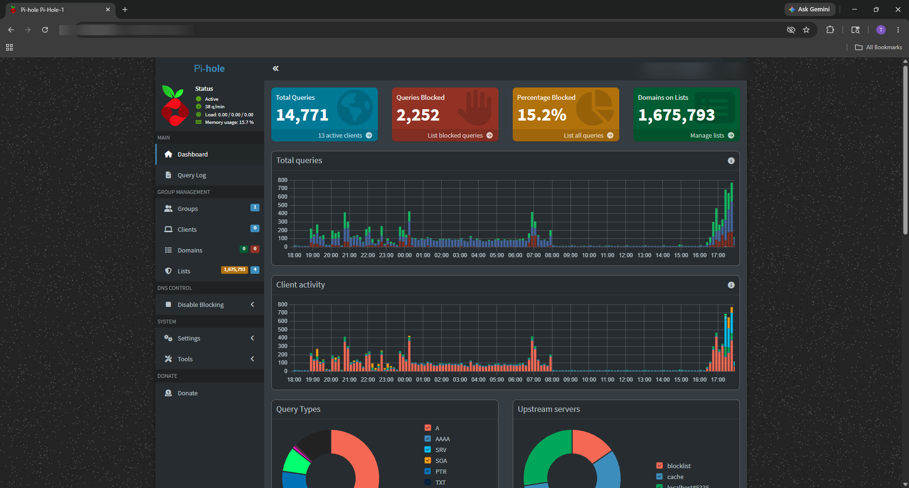

# IT Career Portfolio — Michael Kelly

> Hands-on homelab portfolio — Linux server infrastructure, Docker containers, DNS filtering, and network configuration. Built on real hardware, documented as I went.

**CompTIA Network+** · **CompTIA Security+** · **CCNA in progress**

---

## About

I'm an IT support professional based in Pensacola, FL working toward network and systems administration. This repo documents the lab work I do outside of my day job — building and running a Linux server, managing Docker containers, configuring networking hardware, and deploying DNS filtering on a Raspberry Pi.

Everything here ran on actual hardware. The troubleshooting logs are real failures I diagnosed and fixed.

**Preferred name:** Trea · **Email:** michaeltkellyiii@gmail.com  
**LinkedIn:** [linkedin.com/in/trea-kelly-03b0352b4](https://linkedin.com/in/trea-kelly-03b0352b4)

---

## Quick Navigation

| Project | What It Covers |
|---------|---------------|
| [Ubuntu Server Homelab →](homelab/README.md) | Ubuntu Server, Docker, Tailscale, Samba, VLAN lab — full writeup with troubleshooting log |
| [Pi-hole DNS Filtering Lab →](homelab/pihole-dns-filtering-lab/README.md) | Pi-hole + Unbound on Raspberry Pi — DNS sinkhole, blocklist tuning, mesh troubleshooting |
| [Screenshots →](screenshots/final/) | Portfolio-ready screenshots, all reviewed for sensitive info |
| [Resume →](resume/trea_resume_master.md) | Current resume |

---

## Projects

### Ubuntu Server Homelab

A self-hosted server built on repurposed Lenovo hardware running Ubuntu Server. No monitor, no keyboard — managed entirely over SSH and Tailscale. Currently running Docker containers, serving media through Jellyfin, sharing files over SMB, and backed by a separately mounted NVMe for storage.

**[→ Full documentation: setup notes, architecture, troubleshooting log](homelab/README.md)**

| Service | What It Does |
|---------|-------------|
| Docker + Portainer | Containerized services with a browser-based management dashboard |
| Jellyfin | Self-hosted media server — streams to any device on the network |
| Tailscale | WireGuard VPN overlay — server reachable from anywhere, no port forwarding needed |
| Samba | NVMe storage accessible as a mapped drive from Windows |

**Architecture:**

```
┌──────────────────────────────────────────────────────────────┐
│                   Home Network (LAN)                         │
│                                                              │
│   ┌──────────────────────────────────────────────────────┐   │
│   │               Ubuntu Server — esther                 │   │
│   │                                                      │   │
│   │   SSH (port 22)          Tailscale (WireGuard VPN)   │   │
│   │                                                      │   │
│   │   Docker Engine                                      │   │
│   │   ├── Portainer ──────── ports 9000, 9443            │   │
│   │   └── Jellyfin  ──────── port 8096                   │   │
│   │                                                      │   │
│   │   Samba (SMB) ─────────── port 445                   │   │
│   │                                                      │   │
│   │   Storage                                            │   │
│   │   ├── sda  (465.8 GB SSD)  →  /  via LVM            │   │
│   │   └── nvme (931.5 GB NVMe) →  /mnt/fast-storage      │   │
│   └──────────────────────────────────────────────────────┘   │
│                                                              │
│   Windows PC ────── SMB ────── faststorage (\\esther) Z:     │
└──────────────────────────────────────────────────────────────┘

                 Tailscale overlay (100.x.x.x)
    ┌───────────────────────────────────────────────────┐
    │  esther  ←──── encrypted tunnel ────  any device  │
    └───────────────────────────────────────────────────┘
```

All remote access routes through Tailscale. No ports are exposed to the public internet.


*Portainer dashboard — both containers up. Jellyfin shows as healthy (Docker health check passing).*


*SSH into `esther`. The "Last login from" line confirms the previous connection came over Tailscale. Stats: 0.02 load average, 10% memory, 31°C.*

---

### Pi-hole DNS Filtering Lab

Network-wide DNS sinkhole on a Raspberry Pi with Unbound as a recursive upstream resolver. Every DNS query on the network routes through it — ad, tracking, and malicious domains are blocked before the request leaves the local network. Includes TP-Link Deco mesh integration and troubleshooting documentation.

**[→ Full documentation: DNS flow design, blocklist strategy, troubleshooting notes](homelab/pihole-dns-filtering-lab/README.md)**



*Pi-hole dashboard. Every DNS request on the network passes through here — blocked domains return NXDOMAIN without ever leaving the local network.*

---

## Real Problems Solved

These are actual failures from the build — not contrived exercises. The diagnostic path matters as much as the fix.

| Problem | Root Cause | How It Was Fixed |
|---------|-----------|-----------------|
| SSH "connection refused" on fresh Ubuntu Server install | `openssh-server` not installed by default depending on install options selected | Identified with `systemctl status ssh`; installed and enabled manually |
| Docker container exited immediately after launch | Port conflict — previous Portainer attempt still allocated port 9000 | Diagnosed with `ss -tuln`; stopped and removed the conflicting container |
| Jellyfin running but media library scan returned nothing | Container user lacked read permission on the mounted NVMe directory | Found with `docker logs jellyfin`; corrected with `chown` on the mount path |
| NVMe drive disappeared after server reboot | Drive was manually mounted, not persisted in `/etc/fstab` | Added UUID-based entry to `/etc/fstab`; UUID prevents device name shifts at boot |
| Samba share unreachable from Windows despite service running | UFW firewall was blocking port 445 | Added `ufw allow samba`; confirmed `systemctl status smbd` was correct all along |
| Pi-hole DNS settings not reaching any mesh-connected devices | TP-Link Deco in router mode handled its own DHCP and advertised its own IP as DNS — Pi-hole's IP never reached clients | Switched Deco to AP mode; main router regained DHCP control and Pi-hole propagated to all clients |
| Smart TV apps stopped working after adding a new blocklist | Streaming service telemetry domain caught by an aggressive blocklist | Identified exact domain in Pi-hole query log; whitelisted that domain without removing the blocklist |

---

## Technologies Used

**Operating Systems:** Ubuntu Server · Raspberry Pi OS  
**Remote Access:** SSH · Tailscale (WireGuard)  
**Containerization:** Docker Engine · Portainer  
**Services:** Jellyfin · Pi-hole · Unbound  
**File Sharing:** Samba (SMB)  
**Networking:** VLANs · Managed Switch CLI · DNS · TCP/IP  
**Storage:** LVM · `/etc/fstab` · NVMe  
**Shell:** Bash  
**Version Control:** Git · GitHub  
**Scripting:** Python (screenshot redaction pipeline)

**Certifications:** CompTIA Network+ · CompTIA Security+  
**In Progress:** CCNA

---

## Repository Structure

| Folder | Contents |
|--------|----------|
| [`homelab/`](homelab/) | Ubuntu Server project — setup notes, troubleshooting log, architecture docs, VLAN lab |
| [`homelab/pihole-dns-filtering-lab/`](homelab/pihole-dns-filtering-lab/) | Pi-hole + Unbound recursive DNS lab on Raspberry Pi |
| [`screenshots/final/`](screenshots/final/) | Portfolio-ready screenshots, reviewed and redacted |
| [`resume/`](resume/) | Current resume |

---

## Current Learning Roadmap

**Completed:**
- Ubuntu Server setup and administration
- SSH remote access (headless server management)
- Docker and container management (Portainer, Jellyfin)
- Persistent storage with `/etc/fstab` and UUIDs
- Samba SMB file sharing
- Tailscale WireGuard VPN
- Pi-hole DNS sinkhole with Unbound recursive resolver
- Managed switch VLAN configuration via serial console (ADTRAN NetVanta)
- CompTIA Network+ ✓
- CompTIA Security+ ✓

**In Progress:**
- CCNA lab work (subnetting, routing protocols, switching)
- Network segmentation and VLAN trunking

**Next Lab Priorities:**
- pfSense firewall deployment and configuration
- Monitoring stack (Uptime Kuma or Grafana + Prometheus)

---

## Community

**Hack the Coast** (May 2026) — Volunteer staff at the inaugural Gulf Coast Cybersecurity Conference in Pensacola, FL. Twelve sessions covering red/blue team operations, cloud security, OSINT, and cyber careers; live CTF competition and OSINT Village. Organized by IT Gulf Coast in collaboration with BSides Pensacola and the DEF CON 850 community.

---

## Privacy Note

All screenshots have been reviewed before publishing. Private IPs, internal hostnames, and work-related browser content have been blurred or cropped. Raw screenshots are excluded from version control via `.gitignore`.

---

*Michael Kelly · IT Support Professional · Pensacola, FL*  
[LinkedIn](https://linkedin.com/in/trea-kelly-03b0352b4) · michaeltkellyiii@gmail.com
