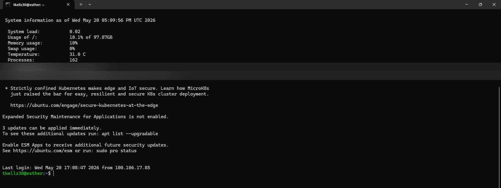
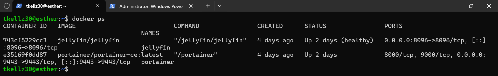
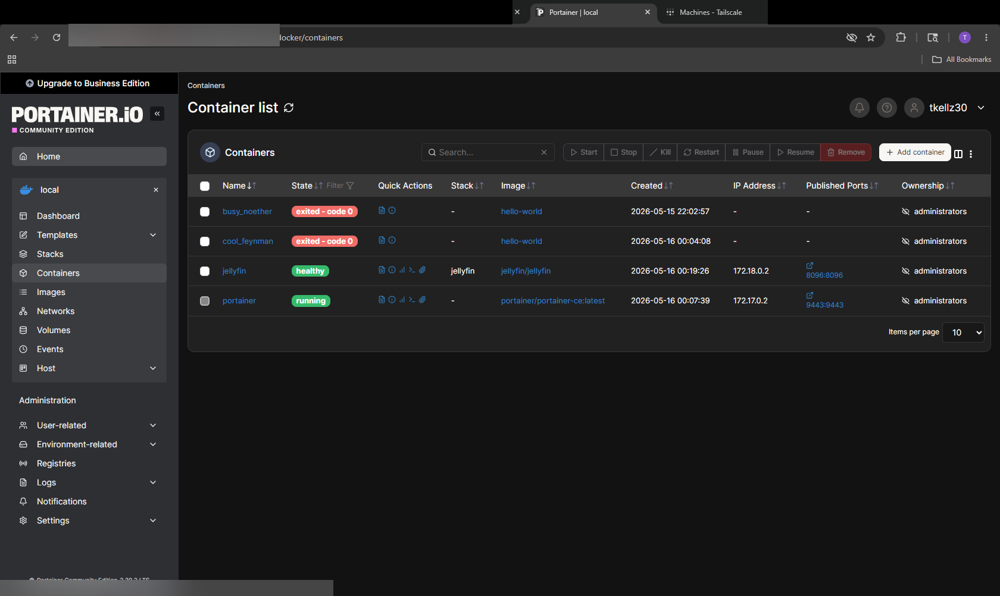
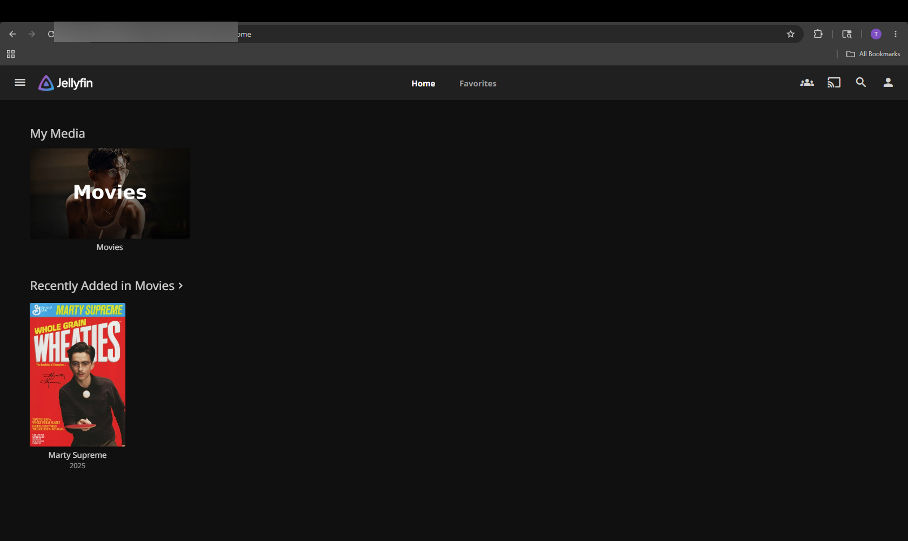
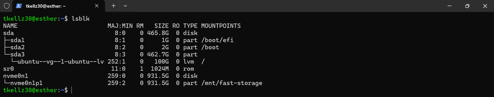
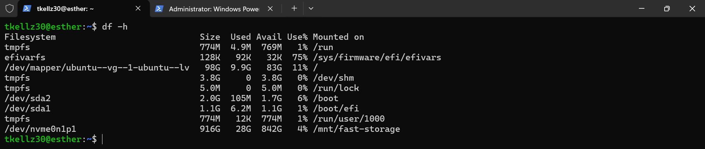
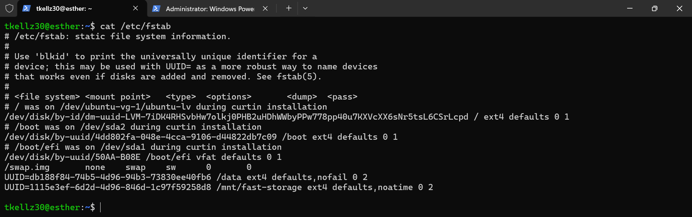
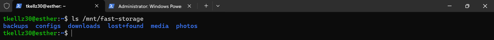
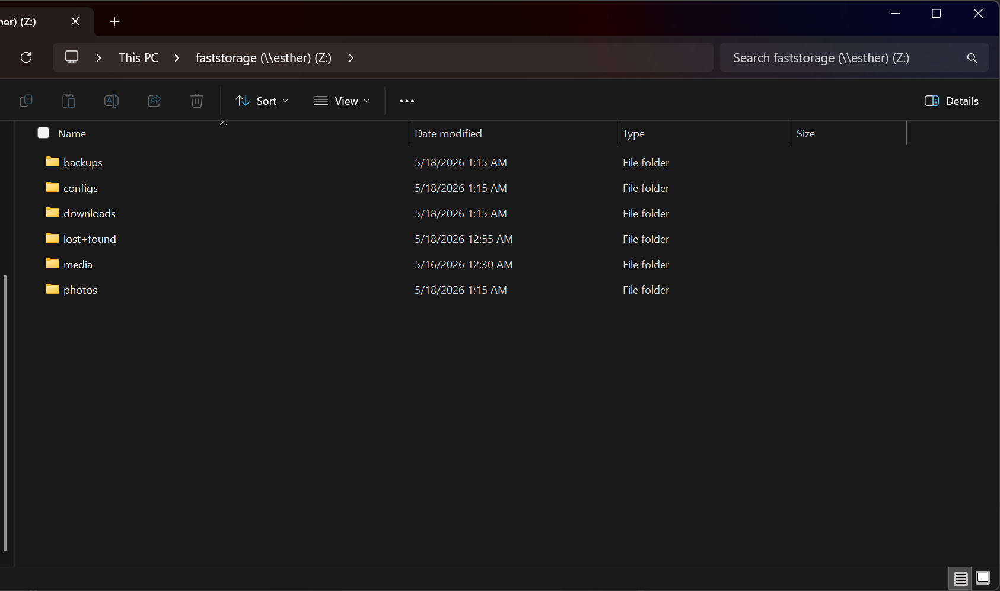

# Linux Homelab — Infrastructure Project

> Self-hosted Linux server built on physical hardware to develop real skills in system administration, remote access, containerization, and storage management.

**Skills demonstrated:** Linux administration · SSH · Docker · Tailscale VPN · Portainer · Samba/SMB · `/etc/fstab` · Ubuntu Server · Git · Managed Switch CLI · VLAN configuration

---

## Table of Contents

- [Overview](#overview)
- [Hardware](#hardware)
- [Technologies](#technologies)
- [Architecture](#architecture)
- [Remote Access](#remote-access)
- [Docker and Containers](#docker-and-containers)
- [Self-Hosted Services](#self-hosted-services)
- [Storage Configuration](#storage-configuration)
- [File Sharing](#file-sharing)
- [Managed Switch / VLAN Lab](#managed-switch--vlan-lab)
- [Troubleshooting](#troubleshooting)
- [Lessons Learned](#lessons-learned)
- [Future Improvements](#future-improvements)
- [Interview Summary](#interview-summary)

---

## Overview

This project documents the build-out of a self-hosted server environment on repurposed physical hardware. The goal was hands-on experience with the tools that appear in real helpdesk, sysadmin, NOC, and infrastructure support roles — not lab simulations.

The server runs Ubuntu Server headless, manages Docker containers through Portainer, serves media through Jellyfin, and is accessible remotely over SSH and Tailscale from any device. All storage is persistently mounted and organized. File sharing works from Windows over SMB.

Everything here was built, broken, debugged, and documented on real hardware.

---

## Hardware

| Component | Details |
|-----------|---------|
| Server | Lenovo desktop, repurposed as a dedicated home server |
| Boot Drive | Samsung SSD (465.8 GB) — OS and Docker |
| Storage Drive | NVMe SSD (931.5 GB) — media, backups, configs |
| OS | Ubuntu Server (headless — no desktop environment) |
| Network | Connected to home router and mesh network |

---

## Technologies

| Category | Stack |
|----------|-------|
| Operating System | Ubuntu Server |
| Shell | Bash |
| Remote Access | SSH, Tailscale (WireGuard) |
| Containerization | Docker Engine, Portainer |
| Services | Jellyfin |
| File Sharing | Samba (SMB) |
| Storage | LVM, `/etc/fstab`, NVMe |
| Version Control | Git, GitHub |
| Editor | VS Code with Remote-SSH extension |

---

## Architecture

```
┌──────────────────────────────────────────────────────────────┐
│                   Home Network (LAN)                         │
│                                                              │
│   ┌──────────────────────────────────────────────────────┐   │
│   │               Ubuntu Server — esther                 │   │
│   │                                                      │   │
│   │   SSH (port 22)          Tailscale (WireGuard VPN)   │   │
│   │                                                      │   │
│   │   Docker Engine                                      │   │
│   │   ├── Portainer ──────── ports 9000, 9443            │   │
│   │   └── Jellyfin  ──────── port 8096                   │   │
│   │                                                      │   │
│   │   Samba (SMB) ─────────── port 445                   │   │
│   │                                                      │   │
│   │   Storage                                            │   │
│   │   ├── sda  (465.8 GB SSD)  →  /  via LVM            │   │
│   │   └── nvme (931.5 GB NVMe) →  /mnt/fast-storage      │   │
│   └──────────────────────────────────────────────────────┘   │
│                                                              │
│   Windows PC ────── SMB ────── faststorage (\\esther) Z:     │
└──────────────────────────────────────────────────────────────┘

                 Tailscale overlay (100.x.x.x)
    ┌────────────────────────────────────────────┐
    │  esther  ←──── encrypted tunnel ────  remote devices  │
    └────────────────────────────────────────────┘
```

All remote access routes through Tailscale — no ports are open to the public internet.

---

## Remote Access

The server has no monitor or keyboard attached. All administration is done remotely, either from the local network or from anywhere in the world over Tailscale.

**SSH** handles encrypted terminal access. Once connected, the Ubuntu login screen displays live system stats including load, memory usage, temperature, and the origin of the last login — confirming the connection came in through Tailscale.

**Tailscale** creates a WireGuard-based VPN overlay that connects all authorized devices under a private IP range. No port forwarding, no exposed firewall rules — devices authenticate once and are reachable by hostname from anywhere.



*SSH session to the `esther` server. System stats confirm it is running normally: 0.02 load average, 10% memory, 31°C. The "Last login from" line confirms the previous connection arrived over the Tailscale network.*

```bash
# Connect from any authorized device
ssh tkellz30@esther

# Check Tailscale network status from the server
tailscale status
```

---

## Docker and Containers

Docker Engine manages all services as isolated containers. Instead of installing applications directly on the OS — which can create dependency conflicts and make cleanup difficult — each service runs in its own container with defined ports, volumes, and restart policies.

**Portainer** provides a web-based management interface for Docker, making it possible to start, stop, inspect, and remove containers from a browser without needing to SSH in for routine tasks.

### Running Containers



*`docker ps` shows both containers up and healthy. Jellyfin has been running for 2 days with a passing health check. Portainer is running on ports 9000 and 9443.*

```bash
# Check running containers
docker ps

# View logs for a container
docker logs jellyfin
```

### Portainer Dashboard



*Portainer's container list. Jellyfin shows as **healthy** (Docker health check passing). Internal Docker network IPs (172.x.x.x) are assigned automatically. Two exited `hello-world` containers remain from initial Docker testing — these can be cleaned up with `docker container prune`.*

Portainer is accessed through the browser at the server's Tailscale address on port 9443, so it's reachable remotely without additional configuration.

---

## Self-Hosted Services

### Jellyfin Media Server

Jellyfin is a self-hosted media server — the functional equivalent of Plex, with no subscription required. It scans a configured library path, generates metadata, and streams to any browser or Jellyfin client app on the network.

The library path points to `/mnt/fast-storage/media` on the NVMe drive, keeping media off the OS boot drive.



*Jellyfin home page accessed through the browser. The Movies library is populated and the service is streaming from the mounted NVMe storage. Accessible from any device on the Tailscale network.*

**Key configuration steps:**
- Deployed via Docker with the media volume mapped read-only from `/mnt/fast-storage`
- Library scan permissions corrected with `chown` after initial scan failed
- Verified playback from multiple devices on and off the local network

---

## Storage Configuration

The server uses two physical drives with different roles. The SSD holds the operating system and Docker. The NVMe holds everything else — media, backups, configs, and downloads — keeping the OS drive clean and giving Docker images room to grow without competing with stored data.

### Drive Layout



*`lsblk` shows the full block device tree. The SSD (`sda`, 465.8 GB) uses LVM with a 100 GB logical volume at `/`. The NVMe (`nvme0n1`, 931.5 GB) is a single partition mounted at `/mnt/fast-storage`.*

### Storage Usage



*`df -h` confirms both mounts are active. The NVMe reports 916 GB total with 28 GB used — the OS sees it correctly and it is accessible to Docker containers and Samba.*

### Persistent Mounts

Drives mounted manually with `mount` disappear after a reboot. Making them persist requires an entry in `/etc/fstab` using the drive's UUID — a stable identifier that does not change if drives are added or reordered.



*`/etc/fstab` with two custom UUID-based mount entries: `/data` and `/mnt/fast-storage`. The `noatime` option on the NVMe reduces unnecessary write operations. UUIDs were retrieved with `blkid` and tested with `mount -a` before rebooting.*

```bash
# Get UUID for a drive
sudo blkid /dev/nvme0n1p1

# Test fstab without rebooting
sudo mount -a

# Verify mounts after change
df -h
```

### Directory Structure



*Organized top-level directories on the NVMe: `backups`, `configs`, `downloads`, `media`, and `photos`. `lost+found` is created automatically by the filesystem.*

---

## File Sharing

Samba (SMB) makes the NVMe storage accessible as a network drive from any Windows machine on the local network — no extra software required on the client side.

The share `faststorage` maps to `/mnt/fast-storage` on the server and is mounted as drive `Z:` on Windows. This allows dragging and dropping files to and from the server directly in File Explorer.



*Windows File Explorer with the Samba share mounted as `Z:`. The address bar confirms the server hostname (`\\esther`) and share name. All storage folders are accessible.*

**Setup required:**
- Installed `samba` package on the server
- Configured the share block in `/etc/samba/smb.conf`
- Added a Samba user with `smbpasswd`
- Allowed SMB through the firewall with `ufw allow samba`

---

## Managed Switch / VLAN Lab

As an extension of the homelab networking work, I configured a VLAN on a physical managed switch using the serial console CLI — the same workflow used in enterprise and ISP environments.

**Device:** ADTRAN NetVanta 1224ST managed switch
**Access method:** Serial console via PuTTY (no IP management interface required)

### What Was Done

Connected to the switch over serial, entered privileged exec mode, and used `show` commands to understand the existing configuration before making any changes:

- `show version` — confirmed device model, firmware version, and uptime
- `show vlan brief` — reviewed existing VLAN assignments across all ports
- `show interfaces status` — reviewed link state and duplex for all ports
- Identified `eth 0/1` as an existing trunk port carrying tagged traffic

After reviewing the baseline configuration:

- Created **VLAN 20** and named it `lab`
- Assigned **eth 0/10** as an untagged access port on VLAN 20
- Brought the interface up with `no shutdown`
- Verified VLAN creation and port assignment with `show vlan brief` and `show interfaces status`
- Saved the configuration with `write memory`

### Commands Used

```
enable
show version
show vlan brief
show interfaces status
configure terminal
vlan 20
name lab
exit
interface eth 0/10
switchport access vlan 20
no shutdown
end
show vlan brief
show interfaces status
write memory
```

### What This Demonstrates

Working in the switch CLI without a web UI or preconfigured IP address mirrors real-world conditions — managed switches in server rooms and wiring closets are commonly accessed over serial when out-of-band management isn't available. The verify-before-change and verify-after-change workflow (running `show` commands before and after every configuration step) is standard practice in network operations.

---

## Troubleshooting

These are real problems encountered and resolved during the build. Each one is documented in full in [`docs/troubleshooting-log.md`](docs/troubleshooting-log.md).

| Area | Problem | How It Was Resolved |
|------|---------|---------------------|
| BIOS | SSD not detected on first boot | Reseated the drive; set boot order in BIOS |
| OS Install | Ubuntu USB installer would not boot | Recreated USB from verified ISO; adjusted Secure Boot |
| SSH | Connection refused after install | `openssh-server` was not installed by default; installed and enabled it |
| Tailscale | Server not appearing in admin console | Node had not authenticated; ran `tailscale up` to complete auth |
| Docker | Container exiting immediately on start | Port conflict with a previously stopped container; stopped and removed it |
| Storage | NVMe not mounting after reboot | Drive was only manually mounted; added UUID entry to `/etc/fstab` |
| Jellyfin | Library scan found no files | Container user lacked permission to read the mount; corrected with `chown` |
| Samba | Share not reachable from Windows | UFW firewall was blocking port 445; added `ufw allow samba` |

The troubleshooting process used the same tools each time: `systemctl status` to check service state, `journalctl` and `docker logs` to read error output, and `ss -tuln` to check what was listening on which ports.

---

## Lessons Learned

**Read the error message first.** Most Linux failures explain themselves. The instinct to immediately search for a fix before reading the output costs more time than it saves.

**Permissions cause more problems than anything else.** When a service can't access a file or directory, check `ls -lh` and `chown`/`chmod` before assuming the configuration is wrong.

**`/etc/fstab` requires UUIDs, not device names.** `/dev/sdb` changes if drive detection order changes at boot. A UUID stays constant regardless of which port the drive is plugged into.

**Manual configuration first, then automate.** Running `docker run` by hand before writing a Compose file meant understanding what every flag actually did before abstracting it away.

**Document while doing, not after.** Notes written during troubleshooting are accurate. Notes written from memory a week later are not.

**Tailscale removes the hardest part of remote access.** No firewall rules, no port forwarding, no public IP management — devices authenticate once and are reachable by name from anywhere.

---

## Future Improvements

- **Monitoring** — Deploy Uptime Kuma or a similar stack to track container health and alert when services go down
- **Automated backups** — Schedule periodic backups of Docker volumes and configuration files to the `/mnt/fast-storage/backups` directory
- **Docker Compose** — Migrate container definitions from `docker run` commands to Compose files for reproducibility and easier version control
- **Network segmentation** — Extend the VLAN lab work to isolate server traffic with a dedicated VLAN and more restrictive firewall rules on the router
- **Storage redundancy** — Evaluate RAID or ZFS for the data drive to protect against drive failure
- **Reverse proxy** — Add Nginx or Caddy in front of Portainer and Jellyfin for cleaner URLs and centralized TLS

---

## Interview Summary

> For the full Q&A version, see [`interview-prep/technical-questions.md`](interview-prep/technical-questions.md).

I built this homelab on repurposed physical hardware to get experience I couldn't get from studying alone. I installed Ubuntu Server, set up SSH and Tailscale for remote access, and deployed Docker containers — Portainer for container management and Jellyfin as a self-hosted media server. I configured a second drive to mount persistently using `/etc/fstab`, organized its storage layout, and set up Samba so Windows machines on my network can access it as a mapped drive.

The real learning came from the failures. I ran into a drive that wasn't visible in BIOS, an SSH service that wasn't installed by default, a container that exited immediately due to a port conflict, and a Jellyfin library that wouldn't scan because the container lacked file permissions. Fixing each one meant reading logs, checking service status, and working through the problem methodically instead of guessing.

I used AI tools throughout to research error messages and find relevant documentation faster. All testing, validation, and final decisions were done hands-on.

---

## Repository Contents

| File / Folder | Purpose |
|---|---|
| `README.md` | This file |
| `setup-notes.md` | Command reference for each setup phase |
| `troubleshooting.md` | Issue index and quick diagnostic commands |
| `project-notes.md` | Project explanations and talking points |
| `career-snippets.md` | Resume bullet points and LinkedIn description |
| `docs/architecture.md` | Network diagram, service map, port table |
| `docs/troubleshooting-log.md` | Full log: symptom → investigation → fix → lesson |
| `technical-qa/technical-questions.md` | Technical Q&A covering concepts used in this project |

---

*Built and maintained by Trae Kelly — CompTIA Network+ · Security+ · CCNA in progress*
