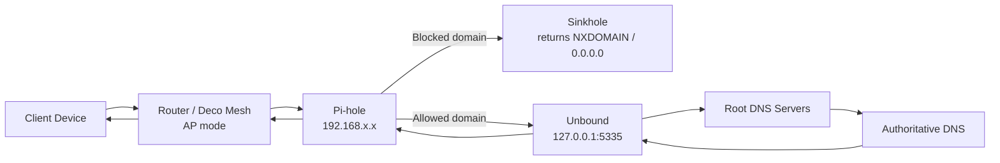

# Pi-hole DNS Filtering Lab

> Raspberry Pi-based DNS sinkhole with Unbound recursive DNS, custom blocklists, and router/mesh integration — built to develop real skills in network DNS, filtering, and troubleshooting.

**Skills demonstrated:** DNS · Pi-hole · Unbound · Raspberry Pi · Blocklist management · Network troubleshooting · Router/mesh configuration · Linux (Raspberry Pi OS)

---

## Table of Contents

- [Project Overview](#project-overview)
- [Why I Built This](#why-i-built-this)
- [Lab Environment](#lab-environment)
- [Goals](#goals)
- [Tools & Technologies](#tools--technologies)
- [Network Design / DNS Flow](#network-design--dns-flow)
- [Setup Summary](#setup-summary)
- [Blocklist Strategy](#blocklist-strategy)
- [Testing & Validation](#testing--validation)
- [Troubleshooting Notes](#troubleshooting-notes)
- [Security & Privacy Considerations](#security--privacy-considerations)
- [What I Learned](#what-i-learned)
- [Future Improvements](#future-improvements)
- [Resume Bullet](#resume-bullet)

---

## Project Overview

This lab documents deploying Pi-hole on a Raspberry Pi as a network-wide DNS sinkhole — a local DNS resolver that intercepts and blocks requests to ad-serving, tracking, and malicious domains before they reach the internet. Pi-hole acts as the DNS server for the entire home network, so every device benefits from filtering without any per-device configuration.

I extended the setup with Unbound, a local recursive DNS resolver. Instead of forwarding queries to a third-party resolver like Google (8.8.8.8) or Cloudflare (1.1.1.1), Unbound resolves DNS from scratch by querying root nameservers directly. This completes a fully self-managed DNS chain: client → Pi-hole → Unbound → root nameservers → authoritative DNS.

The lab includes integration with a home router and Deco mesh system, troubleshooting DNS propagation issues across network layers, blocklist tuning, and documented validation that filtering is actually working as expected.

---

## Why I Built This

I wanted hands-on experience with DNS at a layer most people never interact with. Knowing that DNS exists is different from watching requests resolve in real time, understanding what gets blocked and why, and troubleshooting when a device loses connectivity because a required domain was accidentally blocked.

This project also forced me to work through a real network problem: I had a home network with a main router and Deco mesh APs, and I had to figure out which device was handing out DNS, whether the Deco units were in router or AP mode, and why DNS settings applied at one layer weren't reaching clients at all. That troubleshooting was more educational than the Pi-hole install itself.

---

## Lab Environment

| Component | Details |
|-----------|---------|
| DNS Sinkhole | Raspberry Pi running Pi-hole |
| Recursive Resolver | Unbound, running on the same Raspberry Pi |
| Network | Home router + TP-Link Deco mesh APs |
| Deco Mode | AP mode (DHCP and routing handled by main router) |
| Client Devices | Mix of Windows, Android, and IoT devices |
| Pi-hole Version | Pi-hole v5.x |
| OS on Pi | Raspberry Pi OS (Debian-based) |

IP addresses are sanitized throughout this document. All real device IPs fall in the `192.168.x.x` private range. No real hostnames, MAC addresses, or client names appear in this writeup.

---

## Goals

- Deploy Pi-hole as the primary DNS server for the entire home network
- Configure Unbound as a recursive DNS backend so queries don't depend on third-party resolvers
- Add and tune blocklists to block ads, trackers, and known malicious domains
- Understand the full DNS resolution path from client to authoritative nameserver
- Test and validate that filtering works for both blocked and allowed domains
- Document realistic troubleshooting — the things that went wrong, not just the final state

---

## Tools & Technologies

| Category | Tool / Service |
|----------|---------------|
| DNS Sinkhole | Pi-hole v5.x |
| Recursive Resolver | Unbound |
| Hardware | Raspberry Pi |
| OS | Raspberry Pi OS (Lite) |
| Network Infrastructure | Home router, TP-Link Deco mesh (AP mode) |
| Blocklists | StevenBlack Unified Hosts, HaGeZi Multi-Pro, OISD Big |
| DNS Testing Tools | `nslookup`, `dig`, `ping` |
| Admin Interface | Pi-hole web dashboard (port 80) |

---

## Network Design / DNS Flow

### Before Pi-hole

Every DNS query left the home network and went straight to a third-party resolver. No visibility, no filtering.

```
Client Device → Router (DHCP hands out ISP DNS) → ISP or Google/Cloudflare DNS → Authoritative DNS
```

### After Pi-hole + Unbound



**Key design decisions:**

- **Pi-hole as the network DNS server.** The main router's DHCP server was updated to advertise the Pi's static IP as the DNS server for all clients. Devices pick this up automatically without any per-device changes.
- **Deco in AP mode, not router mode.** The Deco units were initially running in router mode, which created a double-NAT situation where the Deco handled DHCP and handed out its own IP as DNS — so Pi-hole's IP was never reaching clients. Switching the Deco to AP mode gave all DHCP and DNS control back to the main router.
- **Unbound on port 5335.** Pi-hole is configured to forward allowed queries to `127.0.0.1#5335`. Unbound resolves from root nameservers without involving any third-party resolver.

---

## Setup Summary

### 1. Pi-hole Installation

Pi-hole installs with a single command and a guided wizard.

```bash
curl -sSL https://install.pi-hole.net | bash
```

During setup:
- Selected the network interface (`eth0` for wired connection — wired is strongly preferred for a DNS server)
- Set a static IP via a DHCP reservation in the router (not configured on the Pi itself — cleaner for management)
- Selected a temporary upstream DNS for the initial install, replaced later by Unbound

### 2. Unbound Installation and Configuration

```bash
sudo apt install unbound
```

Unbound runs as a recursive resolver on `127.0.0.1:5335`. The config file lives at `/etc/unbound/unbound.conf.d/pi-hole.conf`.

Key settings:

```
server:
  interface: 127.0.0.1
  port: 5335
  do-ip4: yes
  do-udp: yes
  do-tcp: yes
  harden-glue: yes
  harden-dnssec-stripped: yes
  use-caps-for-id: yes
  edns-buffer-size: 1472
  prefetch: yes
  num-threads: 1
  root-hints: "/var/lib/unbound/root.hints"
```

After configuring Unbound, the upstream DNS in Pi-hole (Settings → DNS) is changed to `127.0.0.1#5335`.

The `root.hints` file tells Unbound where the root nameservers are. It's downloaded once and refreshed periodically:

```bash
wget https://www.internic.net/domain/named.root -O /var/lib/unbound/root.hints
```

### 3. Router DNS Configuration

The main router's DHCP server was updated to hand out the Pi's IP as the DNS server for all clients. On most consumer routers this is one field under LAN/DHCP settings:

```
Primary DNS:   192.168.x.x   ← Pi-hole's static IP
Secondary DNS: (intentionally left blank)
```

Setting a secondary DNS that bypasses Pi-hole defeats the filtering — clients fall back to it whenever Pi-hole is slow or unavailable. I left it blank and accept Pi-hole as the single DNS source for the lab.

### 4. Deco Mesh Mode

The Deco units were originally in router mode, which meant:
- Deco was handling DHCP and handing out its own IP as DNS
- Pi-hole's IP was never advertised to clients connected through the mesh
- DNS settings configured on the main router had no effect on Deco clients

**Fix:** Switched Deco units to AP mode via the Deco app. In AP mode, Deco acts as a wireless access point only — all DHCP, routing, and DNS assignment is handled by the main router, and Pi-hole reaches all clients.

---

## Blocklist Strategy

Pi-hole's filtering value scales with the quality and fit of its blocklists. The goal is blocking ads, trackers, and threat domains without breaking legitimate services.

| Blocklist | Purpose |
|-----------|---------|
| StevenBlack Unified Hosts | Broad ad/tracking block; widely used, actively maintained |
| HaGeZi Multi-Pro | Threat-focused: malware, phishing, C2 infrastructure domains |
| OISD Big | General-purpose ad and tracker list |

**Lessons from tuning:**

- **More lists does not mean better.** Adding every available blocklist eventually breaks things. Smart TVs, game consoles, and IoT devices have cloud endpoints that end up blocked by aggressive lists.
- **Whitelisting is part of normal operation, not a failure.** When a service breaks, the Pi-hole query log shows exactly which domain was blocked. The fix is whitelisting that specific domain rather than removing the blocklist.
- **Add one list at a time, then test.** This makes it obvious which list caused a problem when something breaks. Bulk-adding 20 lists and then troubleshooting a broken app is much harder.

### Example Whitelist Entries (sanitized)

```
# Domains that may be blocked by aggressive lists but are required for normal function
# These are generic examples — your actual whitelist depends on your devices and services
clients4.google.com
connectivitycheck.android.com
www.googletagmanager.com
```

---

## Testing & Validation

### DNS Resolution Tests

```bash
# Confirm a normal domain resolves through Pi-hole
nslookup google.com 192.168.x.x

# Confirm a known ad/tracking domain is blocked (should return 0.0.0.0 or NXDOMAIN)
nslookup doubleclick.net 192.168.x.x

# Verify Unbound is responding on its port directly
dig google.com @127.0.0.1 -p 5335

# Check DNSSEC validation is working (should return SERVFAIL for bad record)
dig sigfail.verteiltesysteme.net @127.0.0.1 -p 5335

# Confirm which DNS server a client is actually using
nslookup -type=TXT whoami.akamai.net
```

### Pi-hole Dashboard Checks

- **Total queries** — confirms network traffic is hitting Pi-hole at all
- **Blocked percentage** — baseline for a typical home network runs roughly 15–25%
- **Top blocked domains** — ad networks, telemetry endpoints, tracking pixels
- **Client list** — all devices on the network should appear here once they've made a DNS query
- **Query log** — live view of every DNS request, showing resolved vs. blocked status

### Unbound Status

```bash
# Confirm Unbound service is running
sudo systemctl status unbound

# Test Unbound is resolving from root servers
dig google.com @127.0.0.1 -p 5335

# Check Pi-hole is forwarding to Unbound correctly
pihole -d  # generates a debug log showing upstream config
```

---

## Troubleshooting Notes

| Symptom | Cause | Resolution |
|---------|-------|------------|
| Devices show "connected, no internet" | Pi-hole unreachable; clients could not resolve DNS | Confirmed service state with `pihole status`; reserved a static IP in router to prevent address changes |
| DNS settings not reaching Deco clients | Deco was in router mode, handing out its own DNS instead of Pi-hole | Switched Deco to AP mode; main router's DNS settings now propagate to all clients |
| Smart TV apps stopped loading | Streaming telemetry endpoint blocked by HaGeZi list | Identified blocked domain in query log; whitelisted the specific domain |
| Pi-hole admin dashboard unreachable | `lighttpd` web server crashed | Restarted with `sudo systemctl restart lighttpd` |
| Unbound returning SERVFAIL for everything | `root.hints` file missing or stale | Downloaded fresh root hints with `wget` and restarted Unbound |
| DNS worked on laptop but not phone | Phone was caching previous DNS from before Pi-hole was configured | Flushed DNS cache on phone; toggled airplane mode to force new DHCP lease |
| Queries bypassing Pi-hole from some devices | Device had hardcoded DNS (e.g., pointing directly to 8.8.8.8) | Documented as a known limitation; firewall-based DNS redirect not implemented in this lab |

The Pi-hole query log was the right tool for almost every problem. If something stopped working, the log showed whether the domain was being blocked within seconds.

---

## Security & Privacy Considerations

**Why this matters:**

Standard DNS is unencrypted plaintext. Every query your device sends to 8.8.8.8 or your ISP's resolver is visible in transit — to your ISP, to network observers, and to the resolver itself. Pi-hole + Unbound changes this by keeping resolution local.

- **No third-party resolver.** Unbound queries root nameservers directly. No external DNS provider sees your full query history.
- **Logging stays on the device.** Pi-hole logs are stored locally on the Pi, not sent to any cloud service. I keep 24-hour retention — enough to monitor blocking effectiveness without accumulating a long-term browsing record.
- **Blocklists as a lightweight threat layer.** The HaGeZi threat lists include known malware command-and-control, phishing, and data-exfiltration domains. Blocking at DNS is not a replacement for endpoint security, but it adds a free, network-level layer with no per-device configuration.

**Honest limitations:**

- Pi-hole is a single point of failure. If it goes down, DNS breaks network-wide unless clients have a fallback configured.
- DNS traffic between clients and Pi-hole is still plaintext on the local network. DoH/DoT are not implemented in this lab.
- Devices with hardcoded DNS (common in some IoT products) bypass Pi-hole entirely. This requires firewall rules to intercept, which is outside this lab's scope.
- Pi-hole does not block HTTPS traffic — it only blocks the DNS lookup. A client that already knows the IP of a blocked domain can still connect.

---

## What I Learned

**DNS is the network's phone book and its first line of defense.** Understanding the full resolution path from client to root nameserver to authoritative nameserver made concepts like TTL, DNSSEC, and recursive vs. forwarding resolution concrete.

**Mesh networks add a real layer of DNS complexity.** Running a Deco mesh in router mode creates a double-NAT situation where DHCP — and therefore DNS assignment — is controlled by the Deco, not the main router. Pi-hole settings at the main router level had zero effect on Deco clients until I switched modes. Understanding how AP mode vs. router mode changes the DHCP hierarchy was the critical troubleshooting insight.

**Blocklists need ongoing maintenance.** Adding a blocklist is not a one-time step. Services change their domain names, new tracking domains appear, and aggressive lists will occasionally break a legitimate service. The query log is the right tool for diagnosing these breakages without guesswork.

**The query log is the most useful debugging tool in the setup.** Almost every DNS-related problem showed up there in seconds. If something stops working, checking the query log before assuming the issue is elsewhere is the right first move.

**Whitelisting a domain is not a failure.** The goal of DNS filtering is blocking what should be blocked. Overly aggressive blocking that breaks services people actually use defeats the purpose. Maintaining a clean, deliberate whitelist is part of running the tool correctly.

**Unbound adds privacy but adds fragility.** Recursive DNS from root servers is slower than forwarding to a cached resolver, and a stale or missing `root.hints` file will break all resolution. The trade-off is worth understanding before deploying in any environment where others depend on the network.

---

## Future Improvements

- **DNS-over-HTTPS or DNS-over-TLS** — Explore encrypted upstream options to protect the Pi-hole → Unbound path from local network observers
- **VLAN segmentation** — Isolate IoT devices on a separate VLAN with its own DNS filtering profile
- **Conditional forwarding** — Forward local domain lookups to the router so Pi-hole can resolve device hostnames by name
- **Firewall-based DNS redirect** — Intercept hardcoded DNS traffic from IoT devices and force it through Pi-hole using iptables rules
- **Monitoring and alerting** — Set up a health check so something notifies when Pi-hole goes down before the whole network notices
- **Pi-hole v6 evaluation** — Pi-hole v6 introduced architectural changes; evaluate the upgrade path from v5

---

## Resume Bullet

> Deployed and troubleshot a Raspberry Pi-based Pi-hole DNS filtering lab with Unbound recursive DNS; configured custom blocklists, diagnosed router/mesh DNS propagation issues (AP mode vs. router mode), and documented validation steps for a GitHub portfolio.

---

*Screenshots for this project are pending privacy review. See [`screenshots/README.md`](screenshots/README.md) for the planned screenshot checklist.*

---

*Built and maintained by Michael Kelly — CompTIA Network+ · Security+ · CCNA in progress*
